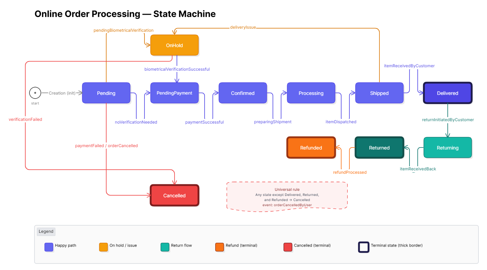
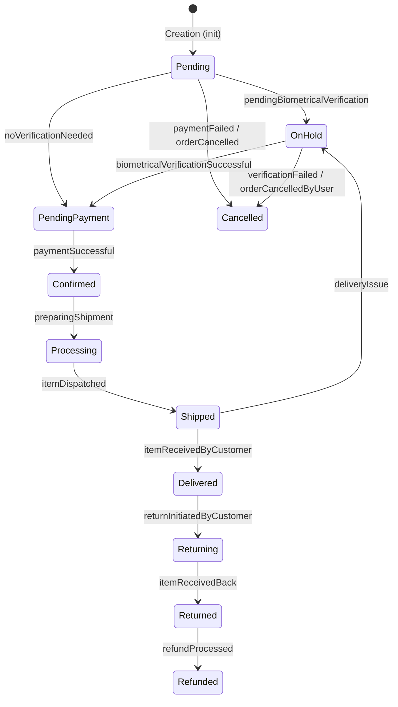
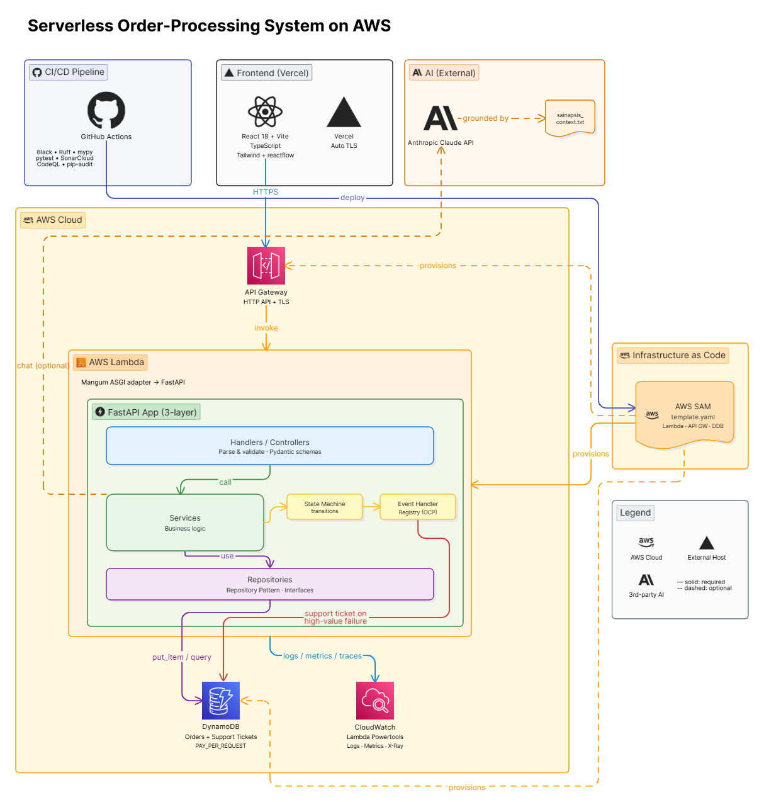
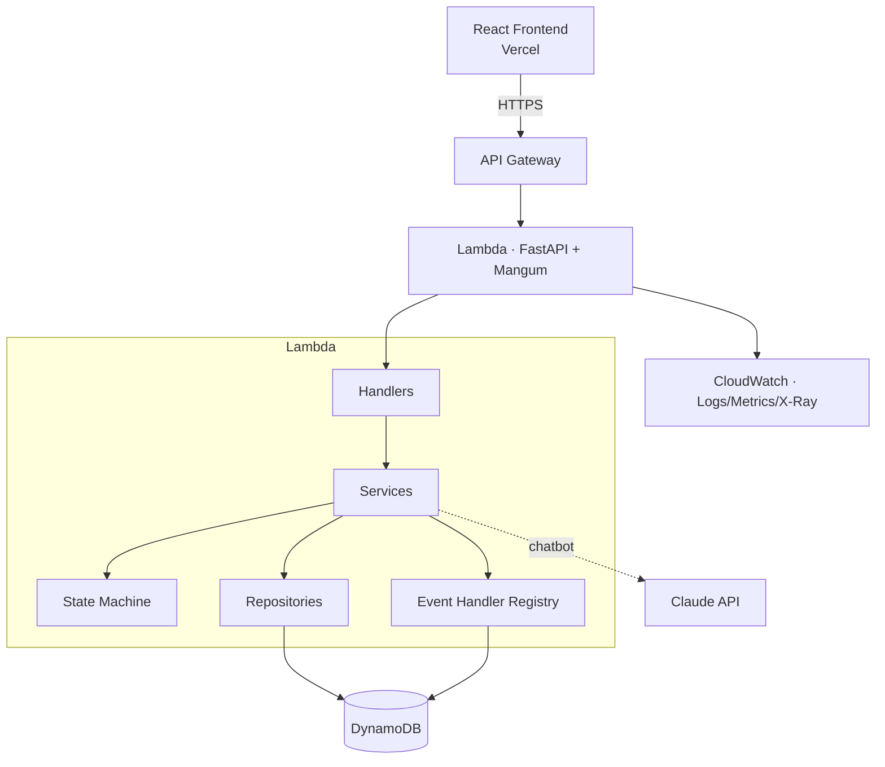

# 📦 Order Processing State Machine

```
 ██████╗ ██████╗ ██████╗ ███████╗██████╗     ███████╗███╗   ███╗
██╔═══██╗██╔══██╗██╔══██╗██╔════╝██╔══██╗    ██╔════╝████╗ ████║
██║   ██║██████╔╝██║  ██║█████╗  ██████╔╝    ███████╗██╔████╔██║
██║   ██║██╔══██╗██║  ██║██╔══╝  ██╔══██╗    ╚════██║██║╚██╔╝██║
╚██████╔╝██║  ██║██████╔╝███████╗██║  ██║    ███████║██║ ╚═╝ ██║
 ╚═════╝ ╚═╝  ╚═╝╚═════╝ ╚══════╝╚═╝  ╚═╝    ╚══════╝╚═╝     ╚═╝
```

> **Technical Assessment — Sainapsis / Bridge Talent**
> Backend Engineering · State Machine for an Online Order Processing System
>
> Built with a software-architect mindset: clean layered architecture, full test
> coverage, observability, CI/CD, DevSecOps gates, and an AI assistant grounded
> in real Sainapsis & Bridge context.

---

<!-- Live status badges -->
[](https://github.com/AnderssonProgramming/state-machine-bridge-test/actions/workflows/ci.yml)
[](https://github.com/AnderssonProgramming/state-machine-bridge-test/actions/workflows/codeql.yml)
[](https://github.com/AnderssonProgramming/state-machine-bridge-test/actions/workflows/deploy.yml)

<!-- SonarCloud quality gates -->
[](https://sonarcloud.io/summary/new_code?id=AnderssonProgramming_state-machine-bridge-test)
[](https://sonarcloud.io/summary/new_code?id=AnderssonProgramming_state-machine-bridge-test)
[](https://sonarcloud.io/summary/new_code?id=AnderssonProgramming_state-machine-bridge-test)
[](https://sonarcloud.io/summary/new_code?id=AnderssonProgramming_state-machine-bridge-test)

<!-- Tech stack badges -->


---

## 👤 Author

| Field | Detail |
|---|---|
| **Name** | Andersson David Sánchez Méndez |
| **Institution** | Escuela Colombiana de Ingeniería Julio Garavito |
| **Program** | Systems Engineering — 8th Semester |
| **Assessment** | Sainapsis Backend Technical Test |

---

## 🔗 Live Demo

| Layer | URL |
|---|---|
| Frontend (Vercel) | `https://state-machine-bridge-test.vercel.app/` |
| Frontend (Vercel) Preview | `https://state-machine-bridge-test-3h32o6u74-andersson-sanchezs-projects.vercel.app/` |
| Frontend (Vercel) Production | `https://state-machine-bridge-test-pta4b3nft-andersson-sanchezs-projects.vercel.app/` |
| Backend API (API Gateway) | `https://qg7s02wixb.execute-api.us-east-1.amazonaws.com` |
| API Docs (Swagger UI) | `https://qg7s02wixb.execute-api.us-east-1.amazonaws.com/docs` |

---

## 📋 Table of Contents

1. [Overview](#-overview)
2. [What Makes This Solution Stand Out](#-what-makes-this-solution-stand-out)
3. [State Machine](#-state-machine)
   - [States](#states)
   - [Transitions](#transitions)
4. [Architecture](#️-architecture)
5. [Tech Stack](#️-tech-stack)
6. [Project Structure](#-project-structure)
7. [Requirements Coverage](#-requirements-coverage)
8. [Quality Attributes](#-quality-attributes)
9. [Getting Started](#-getting-started-local)
10. [Environment Variables](#-environment-variables)
11. [Testing](#-testing)
12. [API Reference](#-api-reference)
13. [AI Assistant (Chatbot)](#-ai-assistant-chatbot)
14. [CI/CD & DevSecOps](#-cicd--devsecops)
15. [Deployment](#-deployment)
16. [Design Decisions (ADRs)](#-design-decisions-adrs)
17. [Engineering Practices](#-engineering-practices)
18. [License](#-license)
19. [References](#-references)

---

## ✨ Overview

A **state machine** that manages online orders through their full lifecycle —
from creation to delivery, returns, refunds, and cancellations — including every
exception-handling path (holds, verification failures, delivery issues).

The MVP exposes a **REST API** (FastAPI) that:

- Creates orders with `productIds` and `amount`, starting in `Pending`.
- Receives events (`orderId` + `eventType` + `metadata`) to drive transitions.
- Rejects illegal transitions with descriptive, typed errors (HTTP 422).
- Supports many order IDs concurrently and thread-safely.
- Applies business rules per event type (e.g. a support ticket on `paymentFailed`
  for orders over $1,000 USD), kept open for extension.
- Maintains a full event/transition history alongside each order.

Beyond the required scope, it ships with an **AI assistant**, a **React
frontend**, **production-grade observability**, **CI/CD**, and **DevSecOps gates** —
everything an evaluator needs to see the full flow end-to-end.

---

## 🌟 What Makes This Solution Stand Out

This test asked for a backend MVP. The solution delivers that core — and then
layers on the things a real production system needs, each chosen deliberately:

- 🧠 **AI chatbot grounded in real Sainapsis/Bridge context** — ask the assistant
  "what does Bridge do?" or "what certifications does Sainapsis have?" and it
  answers correctly about the company itself, plus the order state machine. The
  grounding lives in a curated `context/sainapsis_context.txt`, compiled from
  `sainapsis.com` and `bridge.new`.
- 🏗️ **Clean layered architecture** — a framework-free domain, repository pattern,
  and Open/Closed event handlers. Adding a state or a business rule touches one file.
- ☁️ **Production-grade observability** — AWS Lambda Powertools: structured logs,
  X-Ray traces, and custom CloudWatch metrics.
- ✅ **Full test suite** — unit + integration tests covering every transition,
  every error path, concurrency, and the `paymentFailed > $1000` rule.
- 🔒 **DevSecOps** — CodeQL, SonarCloud, pip-audit, pre-commit, branch rulesets,
  PR-only flow.
- 🚀 **Deployed** — backend on AWS Lambda (SAM IaC), frontend on Vercel, both over HTTPS.

---

## 🔄 State Machine

### States

The full machine includes **11 states**:

| State | Description |
|---|---|
| `Pending` | ⏳ Order created, awaiting routing |
| `OnHold` | 🔒 Awaiting biometric verification or delivery issue |
| `PendingPayment` | 💳 Verification passed, awaiting payment |
| `Confirmed` | ✅ Payment successful |
| `Processing` | 🏭 Shipment being prepared |
| `Shipped` | 🚚 Item dispatched |
| `Delivered` | 📬 Item received by customer |
| `Returning` | 🔁 Customer initiated return |
| `Returned` | 📦 Item received back |
| `Refunded` | 💰 Refund processed |
| `Cancelled` | ❌ Order cancelled |

> The required MVP subset is: `Pending`, `OnHold`, `PendingPayment`, `Confirmed`,
> `Processing`, `Shipped`, `Delivered`. The full machine is implemented end-to-end.

### Transitions

<!-- eraser.io rendered diagram (see /docs/diagrams) -->


> Any non-terminal state (all except `Delivered`, `Returned`, `Refunded`) can
> transition to `Cancelled` via `orderCancelledByUser`.

<details>
<summary>📐 Mermaid source (fallback)</summary>



</details>

---

## 🏛️ Architecture

The system is a serverless, layered application. Requests flow from the React
frontend through API Gateway into a single FastAPI app on Lambda (via Mangum),
which is internally split into Handlers → Services → Repositories.

<!-- eraser.io rendered diagram (see /docs/diagrams) -->


**Layering:** **Handlers** (parse/validate requests) → **Services** (business
logic + state machine) → **Repositories** (persistence / 3rd-party). The domain
layer has **zero framework dependencies**.

**Key design patterns:**

- **Repository Pattern** — all data/external interactions go through repository
  interfaces (`OrderRepository`, `SupportRepository`). Swappable: in-memory locally,
  DynamoDB in production, with no change to services or handlers.
- **Strategy / Handler Registry** — business logic per `eventType` is registered
  independently (`EventHandlerRegistry`), making it Open/Closed for extension.
- **State Machine Pattern** — transitions are declared in a table; illegal moves
  raise typed exceptions.

<details>
<summary>📐 Mermaid source (fallback)</summary>



</details>

---

## 🛠️ Tech Stack

**Backend:** Python 3.13 · FastAPI · Mangum · Pydantic v2 · AWS Lambda Powertools · boto3 · Anthropic SDK
**Frontend:** React 18 · Vite · TypeScript · TailwindCSS · React Router · reactflow
**Infra:** AWS Lambda · API Gateway (HTTP API) · DynamoDB · AWS SAM · Vercel
**Quality & Security:** pytest · Black · Ruff · mypy · SonarCloud · CodeQL · pip-audit · pre-commit

---

## 📁 Project Structure

```
state-machine-bridge-test/
├── backend/
│   ├── src/
│   │   ├── domain/         # entities, state machine, events, exceptions (framework-free)
│   │   ├── services/       # OrderService, event_handlers/, chat_service
│   │   ├── repositories/   # ABCs + InMemory + DynamoDB implementations
│   │   ├── handlers/       # FastAPI routers + DI wiring
│   │   ├── models/         # Pydantic schemas (camelCase API contracts)
│   │   ├── observability/  # Powertools instances (logger, tracer, metrics)
│   │   ├── config.py       # typed settings (env-driven)
│   │   └── main.py         # app + Lambda handler
│   ├── context/            # chatbot grounding (Sainapsis + Bridge + order SM)
│   ├── tests/              # unit/ + integration/
│   ├── requirements.txt
│   └── requirements-dev.txt
├── frontend/               # React + Vite app (Dashboard, Create, Detail, ChatWidget, live diagram)
├── docs/
│   ├── adr/                # architecture decision records (ADR-001..005)
│   └── diagrams/           # eraser.io exports (state-machine.png, architecture.png)
├── .github/workflows/      # ci.yml · codeql.yml · deploy.yml
├── pyproject.toml          # black / ruff / mypy / pytest config
├── sonar-project.properties
├── template.yaml           # AWS SAM infrastructure
├── LICENSE                 # Apache 2.0
└── README.md
```

---

## ✅ Requirements Coverage

### Functional (from the test definition)

| # | Requirement | Status |
|---|---|---|
| 1 | Create order with `productIds[]` and `amount`, initial state `Pending` | ✅ |
| 2 | Process events with `orderId`, `eventType`, and `metadata` | ✅ |
| 3 | Concurrent multi-order support · error on invalid transition | ✅ |
| 4 | `paymentFailed` + amount > $1,000 → create support ticket (extensible) | ✅ |
| 5 | Repository pattern for all 3rd-party interactions | ✅ |
| 6 | Event log + state transition history *(optional)* | ✅ |

### Frontend Bonus

| # | Requirement | Status |
|---|---|---|
| A | Create Order form → calls API, shows `orderId` + initial state | ✅ |
| B | Order State Viewer + dropdown of **valid** next events (`/available-events`) | ✅ |
| C | Live State Machine Diagram, current state highlighted in real time | ✅ |

### Seniority Bonus

| ⭐ | AWS Serverless + AWS Lambda Powertools | ✅ |

---

## 🏆 Quality Attributes

| Attribute | How it's addressed |
|---|---|
| **Maintainability** | 3-layer architecture, SOLID, documented ADRs |
| **Extensibility** | New event rule = 1 handler class, zero changes to existing code |
| **Testability** | Repository interfaces, dependency injection, 85%+ coverage target |
| **Observability** | Powertools structured logs, X-Ray traces, custom metrics |
| **Security** | CodeQL, pip-audit, SonarCloud, no secrets in code, env-driven config |
| **Deployability** | SAM IaC + CI/CD, local/prod environment parity (same codebase) |
| **Concurrency** | Thread-safe in-memory repo; stateless Lambda + DynamoDB in prod |

---

## 🚀 Getting Started (Local)

### Prerequisites

- Python 3.13+
- Node.js 20+
- pip

### Backend

```bash
cd backend
python -m venv .venv
source .venv/bin/activate          # Linux / macOS
.venv\Scripts\activate             # Windows
pip install -r requirements.txt -r requirements-dev.txt
cp .env.example .env               # set ANTHROPIC_API_KEY to enable chat
uvicorn src.main:app --reload --port 8000
```

→ API at `http://localhost:8000` · interactive docs at `http://localhost:8000/docs`

### Frontend

```bash
cd frontend
npm install
cp .env.example .env               # VITE_API_URL=http://localhost:8000
npm run dev
```

→ App at `http://localhost:5173`

---

## 🔐 Environment Variables

**Backend (`backend/.env`)**

| Variable | Purpose |
|---|---|
| `ANTHROPIC_API_KEY` | Claude API key for the chatbot |
| `REPOSITORY_BACKEND` | `memory` (local) or `dynamodb` (prod) |
| `DYNAMODB_TABLE_NAME` | Orders table name (DynamoDB) |
| `DYNAMODB_TICKETS_TABLE_NAME` | Support tickets table name (DynamoDB) |
| `AWS_REGION` | AWS region for DynamoDB |
| `LOG_LEVEL` | Powertools log level (default `INFO`) |
| `POWERTOOLS_SERVICE_NAME` | Service name for logs/traces/metrics |

**Frontend (`frontend/.env`)**

| Variable | Purpose |
|---|---|
| `VITE_API_URL` | Base URL of the FastAPI backend (default `http://localhost:8000`) |

---

## 🧪 Testing

```bash
pytest      # run from repo root; coverage in terminal + coverage.xml
```

Covers: every valid/invalid transition, the `paymentFailed > $1000` rule (incl.
the exact `$1000.00` boundary), concurrency safety (20 parallel writers), the full
HTTP lifecycle to `Delivered`, universal cancellation rules, the DynamoDB repo
(via `moto`), DI wiring, and error responses (404/422).

---

## 📡 API Reference

| Method | Path | Description |
|---|---|---|
| `POST` | `/orders` | Create an order (`productIds`, `amount`) → `Pending` |
| `POST` | `/orders/{id}/events` | Apply an event (`eventType`, `metadata`) |
| `GET` | `/orders/{id}` | Get an order with full history |
| `GET` | `/orders` | List all orders |
| `GET` | `/orders/{id}/available-events` | Valid next events for an order |
| `POST` | `/chat` | AI assistant grounded in Sainapsis/Bridge context |
| `GET` | `/health` | Health check |

### Create Order

```http
POST /orders
```
```json
{ "productIds": ["prod-001", "prod-002"], "amount": 249.99 }
```

**Response `201`**

```json
{
  "orderId": "ord-a1b2c3",
  "productIds": ["prod-001", "prod-002"],
  "amount": 249.99,
  "state": "Pending",
  "createdAt": "2026-05-21T10:00:00Z",
  "updatedAt": "2026-05-21T10:00:00Z",
  "history": [
    { "fromState": null, "toState": "Pending", "eventType": "init", "timestamp": "2026-05-21T10:00:00Z", "metadata": {} }
  ]
}
```

### Trigger Event

```http
POST /orders/{orderId}/events
```
```json
{ "eventType": "noVerificationNeeded", "metadata": {} }
```

**Response `200`**

```json
{
  "orderId": "ord-a1b2c3",
  "previousState": "Pending",
  "currentState": "PendingPayment",
  "eventType": "noVerificationNeeded",
  "timestamp": "2026-05-21T10:01:00Z"
}
```

**Error `422` — Invalid transition**

```json
{
  "error": "InvalidTransitionError",
  "detail": "No transition defined for event 'itemDispatched' from state 'Pending'."
}
```

---

## 🤖 AI Assistant (Chatbot)

A floating chat widget (bottom-right of the app) answers questions about
**Sainapsis**, the **Bridge** product, and the **order state machine** itself.

- Powered by the **Claude API** (`POST /chat`).
- Grounded in `context/sainapsis_context.txt`, compiled from `sainapsis.com` and
  `bridge.new` — so it answers accurately about the company and the MVP.
- The system prompt constrains answers to the provided context; out-of-scope
  questions are politely declined with a pointer to the official sites.

> This is the solution's biggest differentiator: the demo becomes self-explaining,
> and the assistant talks knowledgeably about Sainapsis/Bridge to its own evaluators.

---

## 🔁 CI/CD & DevSecOps

All work flows through **Pull Requests** — `main` and `develop` are protected by
**branch rulesets** (no direct pushes; PR review required).

**`ci.yml`** (every PR/push to `develop`/`main`)

- Backend: Black (format) → Ruff (lint) → mypy (types) → pytest (+ coverage) → SonarCloud
- Frontend: type-check + build

**`codeql.yml`** (push/PR + weekly schedule)

- CodeQL security analysis (Python + JavaScript/TypeScript)
- `pip-audit` dependency vulnerability scan

**`deploy.yml`** (push/PR to `main`)

- AWS SAM build + deploy of the backend

**Local pre-commit** mirrors CI: trailing-whitespace, YAML checks, Black, Ruff,
mypy, and Conventional Commits enforcement.

### Required GitHub Secrets

| Secret | Used by |
|---|---|
| `SONAR_TOKEN` | `ci.yml` (SonarCloud) |
| `AWS_ACCESS_KEY_ID` / `AWS_SECRET_ACCESS_KEY` / `AWS_SESSION_TOKEN` | `deploy.yml` |
| `ANTHROPIC_API_KEY` | `deploy.yml` (chatbot in Lambda) |

---

## ☁️ Deployment

- **Backend** → AWS Lambda + API Gateway (HTTP API), provisioned by **AWS SAM**
  (`template.yaml`). DynamoDB tables for orders and support tickets are created by
  the same template (PAY_PER_REQUEST). TLS is handled natively by API Gateway.
- **Frontend** → **Vercel** (automatic TLS, SPA rewrites via `vercel.json`).

```bash
# Backend (from repo root)
sam build
sam deploy --guided        # first time; CI handles subsequent deploys
```

---

## 📐 Design Decisions (ADRs)

Recorded under `docs/adr/`:

| ADR | Decision |
|---|---|
| **001** | FastAPI + Mangum on AWS Lambda — same codebase runs locally (uvicorn) and on Lambda |
| **002** | Deploy target: Lambda + API Gateway (TLS) / Vercel / DynamoDB / SAM |
| **003** | Frontend stack: React + Vite + TypeScript + Tailwind + reactflow |
| **004** | AI chatbot: Claude API + compiled `sainapsis_context.txt` |
| **005** | Quality gates: Black, Ruff, mypy, SonarCloud, CodeQL, pip-audit, ≥85% coverage |

> **On DuckDNS + Certbot:** the original plan considered DuckDNS with Certbot for
> HTTPS. `ADR-002` deliberately **rejected** this in favor of API Gateway's native
> TLS (and Vercel's automatic TLS) — it removes operational overhead (no cert
> renewal cron, no exposed host) while still serving everything over HTTPS both
> locally and in deployment.

---

## 🧹 Engineering Practices

Good programming practices were a first-class goal, not an afterthought:

- **Clean Code** — small, single-purpose functions; intention-revealing names;
  no dead or duplicated code.
- **SOLID** — Single Responsibility per layer; Open/Closed via the event-handler
  registry; Dependency Inversion via repository interfaces + DI.
- **DRY** — the transition table is the single source of truth, reused by the
  backend, the tests, and the frontend diagram.
- **Typed everywhere** — Pydantic v2 schemas, enums for states/events, mypy strict.
- **Simple but functional** — RAM dict locally, DynamoDB in prod, behind one interface.
- **Conventional Commits** — enforced via pre-commit for a readable history.

References that informed these practices are listed below.

---

## 📄 License

Distributed under the **Apache License 2.0** — see [LICENSE](LICENSE).

---

## 📚 References

**Good programming practices**
- 20 Best Programming Practices — https://medium.com/@josueparra2892/20-best-programming-practices-407df688b96e
- Ada Computer Science — Good Practice — https://adacomputerscience.org/concepts/progcon_good_practice
- GeeksforGeeks — Coding Standards & Best Practices — https://www.geeksforgeeks.org/system-design/coding-standards-and-best-practices-for-system-design/

**AWS serverless & observability**
- AWS Lambda Powertools (Python) — https://docs.powertools.aws.dev/lambda/python/latest/
- Powertools best-practices video — https://youtu.be/52W3Qyg242Y
- AWS Serverless E-commerce Platform (reference) — https://github.com/aws-samples/aws-serverless-ecommerce-platform
- AWS SAM — https://docs.aws.amazon.com/serverless-application-model/
- Amazon DynamoDB — https://docs.aws.amazon.com/dynamodb/

**Company & product context (chatbot grounding)**
- Sainapsis — https://www.sainapsis.com
- Bridge by Sainapsis — https://www.bridge.new/en

**Frameworks & libraries**
- FastAPI — https://fastapi.tiangolo.com/
- Mangum — https://mangum.io/
- Pydantic — https://docs.pydantic.dev/
- Anthropic Claude API — https://docs.anthropic.com/
- React — https://react.dev/
- Vite — https://vitejs.dev/
- React Flow (reactflow) — https://reactflow.dev/
- TailwindCSS — https://tailwindcss.com/

**Quality, security & tooling**
- SonarCloud — https://sonarcloud.io/
- CodeQL — https://codeql.github.com/
- pip-audit — https://pypi.org/project/pip-audit/
- pytest — https://docs.pytest.org/
- Black — https://black.readthedocs.io/
- Ruff — https://docs.astral.sh/ruff/
- mypy — https://mypy.readthedocs.io/
- pre-commit — https://pre-commit.com/
- Conventional Commits — https://www.conventionalcommits.org/
- Apache License 2.0 — https://www.apache.org/licenses/LICENSE-2.0
- Shields.io (badges) — https://shields.io/
- Eraser.io (diagrams) — https://www.eraser.io/

---

<div align="center">

Built with 🧠 by **Andersson David Sánchez Méndez**
Escuela Colombiana de Ingeniería Julio Garavito · 2026

</div>
