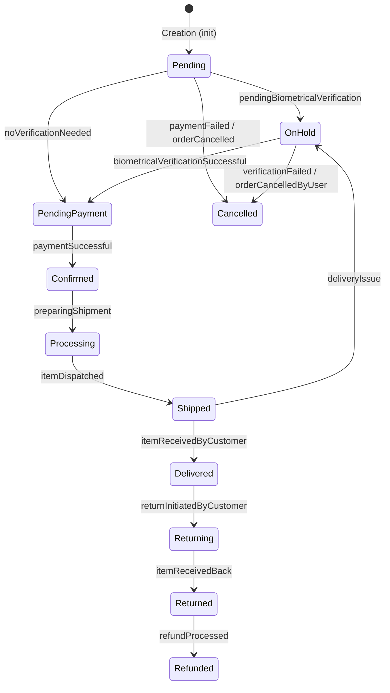

# 📦 Order Processing State Machine

```
 ██████╗ ██████╗ ██████╗ ███████╗██████╗     ███████╗███╗   ███╗
██╔═══██╗██╔══██╗██╔══██╗██╔════╝██╔══██╗    ██╔════╝████╗ ████║
██║   ██║██████╔╝██║  ██║█████╗  ██████╔╝    ███████╗██╔████╔██║
██║   ██║██╔══██╗██║  ██║██╔══╝  ██╔══██╗    ╚════██║██║╚██╔╝██║
╚██████╔╝██║  ██║██████╔╝███████╗██║  ██║    ███████║██║ ╚═╝ ██║
 ╚═════╝ ╚═╝  ╚═╝╚═════╝ ╚══════╝╚═╝  ╚═╝    ╚══════╝╚═╝     ╚═╝
```

> **Technical Assessment — Sainapsis / Bridge Talent**
> Backend Engineering · State Machine for an Online Order Processing System

---


---

## 👤 Author

| Field | Detail |
|---|---|
| **Name** | Andersson David Sánchez Méndez |
| **Institution** | Escuela Colombiana de Ingeniería Julio Garavito |
| **Program** | Systems Engineering — 8th Semester |
| **Assessment** | Sainapsis Backend Technical Test |

---

## 📋 Table of Contents

1. [Problem Overview](#-problem-overview)
2. [State Machine](#-state-machine)
   - [States](#states)
   - [Transitions](#transitions)
3. [Architecture](#-architecture)
4. [Project Structure](#-project-structure)
5. [Requirements](#-requirements)
6. [Getting Started](#-getting-started)
7. [API Reference](#-api-reference)
8. [Design Decisions](#-design-decisions)

---

## 🧩 Problem Overview

A **state machine** that manages online orders through their full lifecycle — from creation to delivery, including exception handling paths (holds, cancellations, returns, and refunds).

The MVP exposes a **REST API** that:
- Creates orders with `productIds` and `amount`.
- Receives events (`orderId` + `eventType` + `metadata`) to drive state transitions.
- Validates illegal transitions and raises descriptive errors.
- Applies business rules per event type (e.g. support ticket on `paymentFailed` for orders > $1,000 USD).

---

## 🔄 State Machine

### States

The full machine includes **11 states**:

| State | Description |
|---|---|
| `Pending` | ⏳ Order created, awaiting routing |
| `OnHold` | 🔒 Awaiting biometric verification or delivery issue |
| `PendingPayment` | 💳 Verification passed, awaiting payment |
| `Confirmed` | ✅ Payment successful |
| `Processing` | 🏭 Shipment being prepared |
| `Shipped` | 🚚 Item dispatched |
| `Delivered` | 📬 Item received by customer |
| `Returning` | 🔁 Customer initiated return |
| `Returned` | 📦 Item received back |
| `Refunded` | 💰 Refund processed |
| `Cancelled` | ❌ Order cancelled |

> The MVP implements the subset: `Pending`, `OnHold`, `PendingPayment`, `Confirmed`, `Processing`, `Shipped`, `Delivered`.

---

### Transitions



> ⚠️ Any state (except `Delivered`, `Returned`, `Refunded`) can transition to `Cancelled` via `orderCancelledByUser`.

---

## 🏗️ Architecture

The service follows a **3-layer architecture** for separation of concerns:

```
┌──────────────────────────────────────────────────────────┐
│                    HTTP / GraphQL                         │
│                                                          │
│  ┌────────────────────────────────────────────────────┐  │
│  │            Layer 1 · Handlers / Controllers        │  │
│  │   Parses requests · Validates input shape          │  │
│  └──────────────────────┬─────────────────────────────┘  │
│                         │                                │
│  ┌──────────────────────▼─────────────────────────────┐  │
│  │           Layer 2 · Services / Resolvers           │  │
│  │   State machine logic · Business rules per event   │  │
│  └──────────────────────┬─────────────────────────────┘  │
│                         │                                │
│  ┌──────────────────────▼─────────────────────────────┐  │
│  │         Layer 3 · Repositories / Adapters          │  │
│  │   Data persistence · External API interactions     │  │
│  └────────────────────────────────────────────────────┘  │
└──────────────────────────────────────────────────────────┘
```

**Key design patterns:**
- **Repository Pattern** — all data/external interactions go through repository interfaces.
- **Strategy / Handler Pattern** — business logic per `eventType` is registered independently, making it easily extendable.
- **State Machine Pattern** — transitions are declared in a table; illegal moves raise typed exceptions.

---

## 📁 Project Structure

```
state-machine-bridge-test/
├── backend/
│   ├── src/
│   │   ├── domain/             # Entities + state machine
│   │   ├── handlers/           # FastAPI routers
│   │   ├── repositories/       # Memory + DynamoDB adapters
│   │   ├── services/           # Orchestration + handlers
│   │   └── main.py
│   ├── tests/
│   ├── requirements.txt
│   └── .env.example
├── frontend/
│   ├── src/
│   │   ├── api/                # Axios client
│   │   ├── components/         # Layout + Chat widget + diagram
│   │   └── pages/              # Dashboard + Order views
│   └── .env.example
├── context/
│   └── sainapsis_context.txt
├── docs/adr/
├── template.yaml               # AWS SAM
└── README.md
```

---

## ✅ Requirements

### Functional

| # | Requirement | Status |
|---|---|---|
| 1 | Create order with `productIds[]` and `amount`, initial state `Pending` | ✅ |
| 2 | Process events with `orderId`, `eventType`, and `metadata` | ✅ |
| 3 | Concurrent multi-order support · error on invalid transition | ✅ |
| 4 | `paymentFailed` + amount > $1,000 → create support ticket | ✅ |
| 5 | Repository pattern for all 3rd-party interactions | ✅ |
| 6 | Event log + state transition history *(optional)* | ✅ |

### Technical Stack

- **Language:** Python 3.13
- **Framework:** FastAPI + Mangum (AWS Lambda ASGI adapter)
- **Storage:** In-memory for local dev, DynamoDB-ready via repository swap
- **Testing:** pytest + coverage

---

## 🚀 Getting Started

### Prerequisites

- Python 3.13+
- Node.js 22+
- pip

### Installation

```bash
# 1. Clone the repository
git clone https://github.com/AnderssonProgramming/state-machine-bridge-test.git
cd state-machine-bridge-test

# 2. Backend setup
cd backend
python -m venv .venv
source .venv/bin/activate          # Linux / macOS
.venv\Scripts\activate             # Windows
pip install -r requirements.txt
cp .env.example .env

# 3. Frontend setup
cd ../frontend
npm install
cp .env.example .env
```

### Run the backend

```bash
cd backend
uvicorn src.main:app --reload --port 8000
```

The API will be available at `http://localhost:8000`.
Interactive docs at `http://localhost:8000/docs`.

### Run the frontend

```bash
cd frontend
npm run dev
```

The UI will be available at `http://localhost:5173` (Vite default).

### Run tests

```bash
cd backend
pytest --cov=src tests/ -v
```

---

## 🔐 Environment Variables

**Backend (`backend/.env`)**

- `ANTHROPIC_API_KEY` — Claude API key for the chatbot
- `REPOSITORY_BACKEND` — `memory` or `dynamodb`
- `DYNAMODB_TABLE_NAME` — table name for orders (when using DynamoDB)
- `DYNAMODB_TICKETS_TABLE_NAME` — table name for support tickets
- `AWS_REGION` — AWS region for DynamoDB

**Frontend (`frontend/.env`)**

- `VITE_API_URL` — base URL for the FastAPI backend (default: `http://localhost:8000`)

---

## 📡 API Reference

### Create Order

```http
POST /orders
```

```json
{
  "productIds": ["prod-001", "prod-002"],
  "amount": 249.99
}
```

**Response `201`**

```json
{
  "orderId": "ord-a1b2c3",
  "productIds": ["prod-001", "prod-002"],
  "amount": 249.99,
  "state": "Pending",
  "createdAt": "2026-05-21T10:00:00Z",
  "updatedAt": "2026-05-21T10:00:00Z",
  "history": [
    {
      "fromState": null,
      "toState": "Pending",
      "eventType": "init",
      "timestamp": "2026-05-21T10:00:00Z",
      "metadata": {}
    }
  ]
}
```

---

### Trigger Event

```http
POST /orders/{orderId}/events
```

```json
{
  "eventType": "noVerificationNeeded",
  "metadata": {}
}
```

**Response `200`**

```json
{
  "orderId": "ord-a1b2c3",
  "previousState": "Pending",
  "currentState": "PendingPayment",
  "eventType": "noVerificationNeeded",
  "timestamp": "2026-05-21T10:01:00Z"
}
```

**Error `422` — Invalid transition**

```json
{
  "error": "InvalidTransitionError",
  "detail": "No transition defined for event 'itemDispatched' from state 'Pending'."
}
```

---

### Get Order

```http
GET /orders/{orderId}
```

**Response `200`**

```json
{
  "orderId": "ord-a1b2c3",
  "productIds": ["prod-001", "prod-002"],
  "amount": 249.99,
  "state": "PendingPayment",
  "history": [
    {
      "fromState": null,
      "toState": "Pending",
      "eventType": "init",
      "timestamp": "...",
      "metadata": {}
    },
    {
      "fromState": "Pending",
      "toState": "PendingPayment",
      "eventType": "noVerificationNeeded",
      "timestamp": "...",
      "metadata": {}
    }
  ]
}
```

---

## 🧠 Design Decisions

**Why a transition table instead of hardcoded conditionals?**
Declaring transitions as a dictionary makes it trivial to add new states or events without touching any handler or service logic — just extend the table.

**Why a per-event handler registry for business rules?**
Requirement 4 asks for logic tied to a specific event (`paymentFailed`). A registry pattern (`{ "paymentFailed": PaymentFailedHandler }`) keeps each rule isolated, testable, and easy to extend — exactly what "easily extendable in the future" means.

**Why in-memory storage?**
The repository abstraction (`OrderRepository`) decouples persistence from business logic. Local development uses an in-memory adapter, while Lambda deployments switch to DynamoDB by configuration — no changes needed in service or handler layers.

---

<div align="center">

Made with 🧠 by **Andersson David Sánchez Méndez**
Escuela Colombiana de Ingeniería Julio Garavito · 2026

</div>